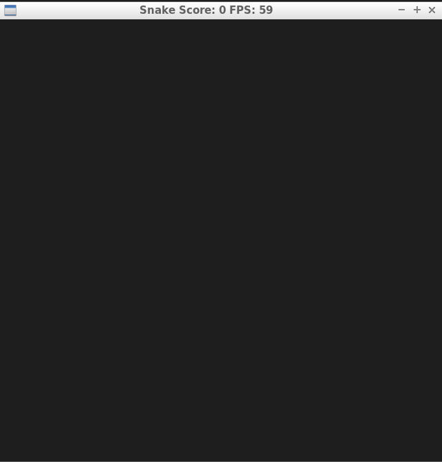
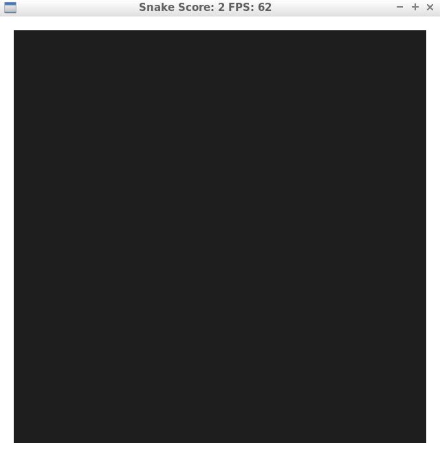
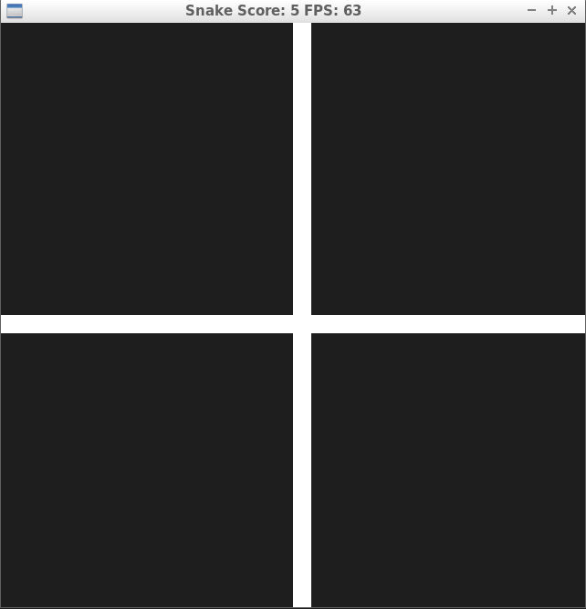
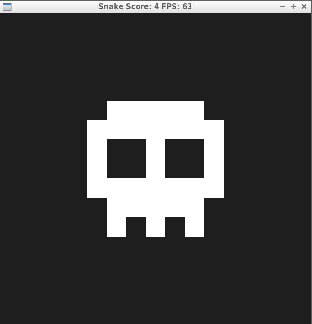

# CPPND: Capstone Snake Game Example

This repo contains the Capstone project in the [Udacity C++ Nanodegree Program](https://www.udacity.com/course/c-plus-plus-nanodegree--nd213). The code for this repo was inspired by [this](https://codereview.stackexchange.com/questions/212296/snake-game-in-c-with-sdl) excellent StackOverflow post and set of responses and was developed to satisfy criterias in sections in [Rubric](https://review.udacity.com/#!/rubrics/2533/view). The solution was built on the project skeleton provided by 
Udacity.

## Description

The game strats by asking for a username and then a play window will appears with the snake and food. Keyboard is used to move the snake toward food. The map will change acordelly to the progression of the user inside the game. The game will also store the score and username after the game is closed. Here is a list with the maps present into the game.

| food range | map      |
|------------|----------|
| 0  - 9    |  |
| 10 - 19    |  |
| 20 - 29    |  |
| 30 - inf   |  |

## Dependencies for Running Locally
* cmake >= 3.7
  * All OSes: [click here for installation instructions](https://cmake.org/install/)
* make >= 4.1 (Linux, Mac), 3.81 (Windows)
  * Linux: make is installed by default on most Linux distros
  * Mac: [install Xcode command line tools to get make](https://developer.apple.com/xcode/features/)
  * Windows: [Click here for installation instructions](http://gnuwin32.sourceforge.net/packages/make.htm)
* SDL2 >= 2.0
  * All installation instructions can be found [here](https://wiki.libsdl.org/Installation)
  * Note that for Linux, an `apt` or `apt-get` installation is preferred to building from source.
* gcc/g++ >= 5.4
  * Linux: gcc / g++ is installed by default on most Linux distros
  * Mac: same deal as make - [install Xcode command line tools](https://developer.apple.com/xcode/features/)
  * Windows: recommend using [MinGW](http://www.mingw.org/)

## Basic Build Instructions

1. Clone this repo.
2. Make a build directory in the top level directory: `mkdir build && cd build`
3. Compile: `cmake .. && make`
4. Run it: `./SnakeGame`.

## Rubric

1. Loops, Functions --> The project code is OOP with the security mechanism in order to avoid fail states
2. The project reads data from a file and process the data, or the program writes data to a file. --> Application read and write the file. (player.h)
3. The project accepts user input and processes the input. -> user input in main.cpp
4. The project uses Object Oriented Programming techniques. -> The project supports OOP
5. Classes use appropriate access specifiers for class members. -> Members in player.h and map.h are explicitly specified as public, protected, or private.
6. Class constructors utilize member initialization lists. -> Constructor of Map class
7. Classes encapsulate behavior. -> Classes Map and Players
